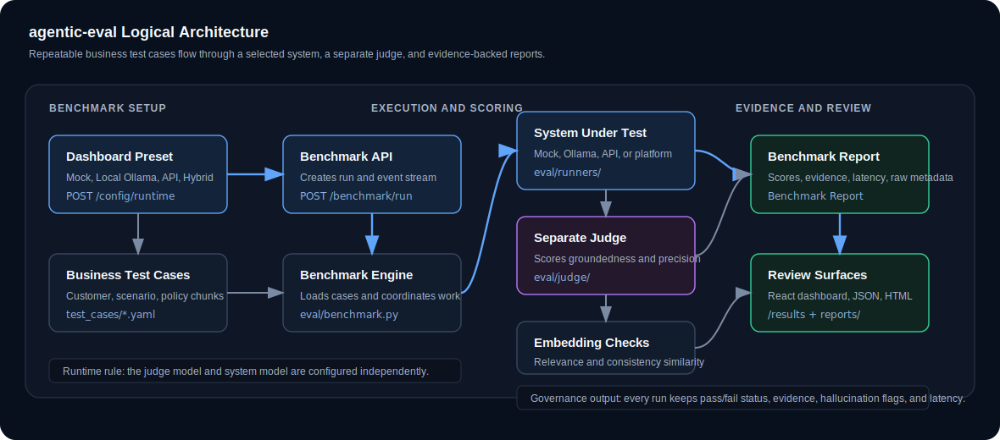

# agentic-eval

Enterprise evaluation framework for LLM-powered agentic systems.

`agentic-eval` benchmarks whether an agentic workflow is grounded, relevant,
stable, and operationally practical before it is trusted in governed business
processes. It is built for pipelines that follow the pattern:

```text
retrieve context -> reason with an LLM -> propose a typed action -> evaluate evidence
```

The project is mock-first, local-first, and production-minded. A clean checkout
can run deterministic benchmarks with no API keys, then graduate to local
Ollama or cloud-backed model evaluation when a team is ready.

Author: Sarala Biswal

## Business Problem

Enterprises are adopting LLM agents for workflows such as payment risk
intervention, billing dispute resolution, churn prevention, customer servicing,
and policy-guided decision support. These systems can produce well-structured
answers while still being wrong in ways that matter:

- The answer may not be grounded in the retrieved policy or customer context.
- The model may invent facts that are not present in source systems.
- The response may be relevant in tone but miss the actual business decision.
- Retrieval may pass noisy documents that confuse the agent or waste tokens.
- The same input may produce inconsistent decisions across repeated runs.
- A model may look accurate but violate latency expectations for production use.

Traditional schema validation only proves that the response shape is correct.
It does not prove that the reasoning is faithful, stable, relevant, or efficient
enough for a governed enterprise workflow.

## How This App Solves It

`agentic-eval` turns governed business scenarios into repeatable benchmark
cases. Each case defines the customer context, retrieved policy evidence,
expected decision signals, hallucination guards, and score thresholds. The app
then runs the system under test and evaluates the output across five dimensions:
faithfulness, answer relevance, context precision, consistency, and
latency/quality tradeoff.

The result is an evidence-backed benchmark report that helps teams answer:

- Can this agent explain its decision from approved context?
- Did the response address the business scenario that was asked?
- Which policy documents were actually useful?
- Does the same case produce the same decision over repeated runs?
- Which model/backend gives the best quality within the latency budget?
- Are there unsupported claims that should block release?

In practice, this gives product, engineering, risk, and governance teams a
shared release gate for agentic systems instead of relying on manual review or
one-off prompt testing.

## What It Evaluates

| Dimension | Purpose | Enterprise risk addressed |
| --- | --- | --- |
| Faithfulness | Verifies factual claims against retrieved context | Unsupported claims and hallucinations |
| Answer relevance | Confirms the response addresses the scenario | Plausible but off-task answers |
| Context precision | Measures whether retrieved chunks were useful | Noisy retrieval and wasted tokens |
| Consistency | Re-runs the same case and compares outputs | Unstable decisions for identical inputs |
| Latency / quality | Compares quality against response time | Model choices that miss service-level expectations |

## Core Capabilities

- Case-file-backed benchmark scenarios for repeatable governed evaluation.
- Separate judge model and system-under-test model configuration.
- Mock, Ollama, and API execution modes.
- FastAPI service for benchmark execution, runtime settings, results, test cases,
  and server-sent live progress events.
- React dashboard for running benchmarks, browsing cases, inspecting results,
  comparing models, and understanding the architecture.
- HTML and JSON report generation for human review and machine processing.
- Startup report cleanup that keeps the latest generated report set manageable.
- No secret values returned through configuration APIs.

## Run Modes

| Mode | Judge | System under test | Best for |
| --- | --- | --- | --- |
| Mock | Deterministic mock judge | Deterministic mock system | CI, UI checks, repeatable local development |
| Local Ollama | `qwen2.5:7b` | `llama3.2` | No-key local model evaluation |
| API | OpenAI via LiteLLM | OpenAI via LiteLLM | Higher-quality final evaluation |
| Hybrid | API judge | Ollama system | Strong external judge over local model outputs |

The judge and system under test should remain separate. Asking the same model to
grade itself can hide quality issues and creates self-evaluation bias.

## Architecture



### Runtime Flow

1. A user selects a benchmark preset and test case group in the dashboard.
2. The UI saves runtime model settings through `POST /config/runtime`.
3. The UI starts a run through `POST /benchmark/run`.
4. FastAPI creates a run id and background task.
5. `BenchmarkEngine` loads matching case files from `test_cases/`.
6. The selected runner calls the system under test and captures raw response metadata.
7. `CompositeEvaluator` scores the output across all evaluation dimensions.
8. Reporters persist JSON and HTML outputs under `reports/`.
9. The UI streams progress from `/benchmark/events/{run_id}` and reads results
   from `/results`.

## Code Walkthrough

This is the end-to-end path for one benchmark case.

| Step | Code path | What happens |
| --- | --- | --- |
| 1 | `ui/src/pages/BenchmarkRunner.tsx` | The user selects a preset and a case group, then clicks Run Benchmark. |
| 2 | `ui/src/api/client.ts` | `updateRuntimeConfig()` saves the selected judge and system models; `startBenchmark()` posts the run request. |
| 3 | `eval/api/routers/config.py` | `POST /config/runtime` validates the model/backend pairing and updates in-memory runtime settings. |
| 4 | `eval/api/routers/benchmark.py` | `POST /benchmark/run` creates the run id, event queue, and background task. |
| 5 | `eval/benchmark.py` | `BenchmarkEngine.run()` loads matching case files, chooses the runner, emits live events, and coordinates scoring. |
| 6 | `eval/runners/ollama_runner.py`, `eval/runners/api_runner.py`, or `eval/runners/mock_runner.py` | The selected runner calls the system under test and returns agent output, latency, model name, and raw metadata. |
| 7 | `eval/evaluators/composite.py` | `CompositeEvaluator` invokes each dimension evaluator and combines the scores. |
| 8 | `eval/judge/client.py` and `eval/judge/prompts.py` | Faithfulness and context precision use the configured judge client and versioned prompts. |
| 9 | `eval/evaluators/answer_relevance.py` and `eval/evaluators/consistency.py` | Embedding similarity checks relevance and repeated-run stability. |
| 10 | `eval/reporters/json_reporter.py` and `eval/reporters/html_reporter.py` | Reports are written to disk for machine processing and human review. |
| 11 | `eval/api/routers/results.py` and `ui/src/pages/ResultDetail.tsx` | The dashboard reads completed reports and shows scores, evidence, policy documents, and consistency outputs. |

## Quick Start

### Prerequisites

- Python 3.12+
- Node.js 20+
- `uv`
- `corepack` with `pnpm`
- Docker and the Ollama CLI only if using local Ollama

### Deterministic Local Run

```bash
git clone https://github.com/saralabiswal/agentic-eval
cd agentic-eval
make install
cp .env.example .env
make demo
```

Default behavior uses mock judge + mock system. It requires no API key and is
designed for repeatable development and CI checks.

### Fully Local Ollama Run

```bash
make docker-up
make ollama-models
make ollama-smoke
```

Recommended local `.env` pairing:

```env
EVAL_JUDGE_BACKEND=ollama
EVAL_JUDGE_MODEL=qwen2.5:7b

SUT_BACKEND=ollama
SUT_MODEL=llama3.2
```

This keeps evaluation local and keyless while preserving judge/system separation:
Qwen judges Llama outputs.

### API-Backed Run

```bash
cp .env.example .env
```

Set:

```env
EVAL_JUDGE_BACKEND=api
EVAL_JUDGE_MODEL=gpt-4o
SUT_BACKEND=api
SUT_MODEL=gpt-4o-mini
OPENAI_API_KEY=your-key
```

Use a different judge model and system model for evaluation. The judge is
assessing the system output, so the normal API setup should not point both roles
at the same model.

Then run:

```bash
make demo
```

## Running the Application

Start the API:

```bash
make dev
```

Start the UI:

```bash
cd ui
corepack pnpm dev
```

Open:

```text
http://localhost:5173
```

The API listens on port `8001` so it can run beside the banking platform on
port `8000`.

## API Surface

| Endpoint | Purpose |
| --- | --- |
| `POST /benchmark/run` | Start a benchmark in the background |
| `GET /benchmark/{run_id}` | Read run status or completed report |
| `GET /benchmark/events/{run_id}` | Stream live benchmark events |
| `GET /results` | List completed benchmark reports |
| `GET /results/{run_id}` | Fetch a full report |
| `GET /cases` | List case-file-backed test cases |
| `GET /cases/{case_id}` | Fetch one test case |
| `GET /config` | Return non-secret effective runtime config |
| `POST /config/runtime` | Update non-secret runtime model selection |
| `POST /config/test-connection` | Check backend reachability without echoing secrets |

## Repository Layout

```text
eval/
  api/          FastAPI routers, state, report loading, startup cleanup
  core/         Pydantic schemas, settings, runtime config, exceptions
  evaluators/   Faithfulness, relevance, precision, consistency, latency
  judge/        Mock, Ollama, and LiteLLM judge clients
  reporters/    JSON, HTML, and terminal report generation
  runners/      Mock, Ollama, API, platform, and direct runners

test_cases/     Benchmark case definitions
tests/          Unit and integration coverage
ui/             React + Vite dashboard
reports/        Generated reports; only .gitkeep is tracked
```

Planning materials are intentionally kept under `docs/planning/` and ignored by
git. Generated reports, build outputs, caches, and local virtual environments
are also ignored.

## Quality Gates

Run these before handing off a branch:

```bash
make test
make typecheck
make lint
cd ui && corepack pnpm typecheck
```

Optional release confidence checks:

```bash
make demo
make ollama-smoke
cd ui && corepack pnpm build
```

## Security and Governance Notes

- `.env` is ignored and must not be committed.
- API keys are never returned from `/config` or connection-test responses.
- Mock mode keeps tests deterministic and avoids accidental cloud calls.
- Ollama mode calls the configured local `OLLAMA_BASE_URL`.
- API mode requires an explicit key and should be used deliberately.
- Judge and system settings are independent to avoid self-evaluation by default.
- Every benchmark result records evidence, hallucination flags, raw response
  metadata, latency, and pass/fail status.

## Adding Test Cases

Add case definition files under `test_cases/<scenario>/`.

Each case should include:

- Customer profile input.
- Retrieved policy chunks.
- Scenario context.
- Expected risk/action signals.
- Hallucination guards.
- Per-dimension thresholds.

Keep test cases as data. Evaluator behavior belongs in Python modules with
focused unit or integration tests.

## Development Standards

- Use `uv` for Python dependency management.
- Use `pnpm` through `corepack` for the UI.
- Add type hints to Python function signatures.
- Use Pydantic models for cross-boundary schemas.
- Keep public classes and methods documented.
- Prefer async I/O for runtime evaluation paths.
- Never commit generated reports, cache directories, local planning files,
  virtual environments, or API keys.

## License

MIT, as declared in `pyproject.toml`.
